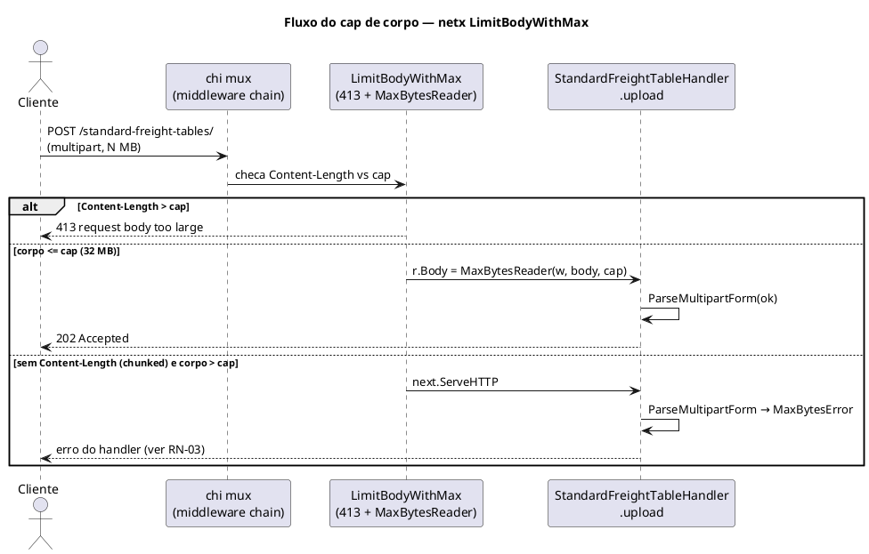

# SDD — request-body-limit

> **Escopo:** cap configurável para o tamanho do corpo de requisições HTTP na camada `netx` do SDK gofi, rejeição honesta com `413` quando o cap é excedido, timeouts de servidor configuráveis por serviço, e o wiring disso no BFF `wiseship`. Substitui o limite fixo de 10 MB — que fazia uploads grandes de planilha (`POST /standard-freight-tables/`) falharem com um erro enganoso — por um valor por-serviço, com o BFF configurado em 32 MB. Não cobre o parsing da planilha em si (contexto `standard-freight-table`).

---

## 0. Manifesto do Serviço

| Atributo | Valor |
|---|---|
| **Nome do serviço** | wiseship (BFF) |
| **Caminho no monorepo** | `backend/` |
| **Go module** | `github.com/anytools/wiseship` |
| **Camada afetada (SDK)** | `netx` — `github.com/joaoprofile/gofi/netx` (upstream: repo `gofi-sdk-go`; espelho local: `.gofi/gofi-sdk-go/netx/`) |
| **Banco de dados** | não se aplica |
| **Porta HTTP** | `:8081` (default do BFF) |
| **Prefixo de rotas** | global (middleware aplicado a todas as rotas) |
| **Redis** | não se aplica |
| **Serviço novo** | não |
| **Contextos já existentes** | todos (mudança cross-cutting de plataforma) |
| **Middleware de auth existente** | sim |

### Estrutura raiz afetada

```
netx/ (upstream gofi-sdk-go; espelhado em .gofi/gofi-sdk-go/netx/)
  http_server_security.go        — DefaultMaxBodyBytes, LimitBody, LimitBodyWithMax
  http_server_route.go           — WSConfig.MaxBodyBytes + timeouts
  http_server.go                 — defaults de timeout, pipeline (mux.Use), ListenAndServe
backend/wiseship/
  main.go                        — wiring do WSConfig (MaxBodyBytes + timeouts) — específico do projeto
```

> A lógica genérica (cap e timeouts configuráveis) mora no SDK `netx`; os valores concretos (32 MB, timeout do upload) são decisão de projeto e vivem no `main.go` do BFF.

---

## 0.1 Decisões de Arquitetura e Padrões

| Decisão | Valor |
|---------|-------|
| **Cache** | não |
| **Mensageria** | não |
| **Consome eventos** | não |
| **Filtro dinâmico** | não |
| **Padrões de projeto** | middleware chain (chi) + factory de middleware configurável |
| **Rate limiting** | inalterado (middleware separado) |
| **Auditoria de operações** | não |
| **Variáveis de ambiente adicionais** | nenhuma no SDK — o BFF decide se lê de env no composition root |
| **Integrações externas** | nenhuma |

### Contratos de Camada

**SDK `netx` — configuração (`http_server_route.go`):**
```go
type WSConfig struct {
    ServerPort     string
    AllowedOrigins []string
    StressControl  *StressControlConfig
    RateLimiter    *RedisRateLimiterConfig

    // MaxBodyBytes caps request bodies. <= 0 → DefaultMaxBodyBytes.
    MaxBodyBytes int64

    // Timeouts; <= 0 → o Default* correspondente.
    ReadTimeout    time.Duration
    WriteTimeout   time.Duration
    IdleTimeout    time.Duration
    RequestTimeout time.Duration
}
```

**SDK `netx` — middleware (`http_server_security.go`):**
```go
// DefaultMaxBodyBytes é o cap aplicado quando WSConfig.MaxBodyBytes <= 0.
const DefaultMaxBodyBytes int64 = 10 << 20 // 10 MB

// LimitBody mantém compat: delega para LimitBodyWithMax(DefaultMaxBodyBytes).
func LimitBody(next http.Handler) http.Handler

// LimitBodyWithMax rejeita com 413 quando r.ContentLength > maxBody (antes do
// handler) e envelopa r.Body em http.MaxBytesReader como rede de segurança
// para requests sem Content-Length. maxBody <= 0 → DefaultMaxBodyBytes.
func LimitBodyWithMax(maxBody int64) Middleware
```

**SDK `netx` — timeout por rota (`http_server_route.go`):**
```go
// Timeouts sobrepõe os deadlines de conexão do servidor para esta rota apenas.
// Zero em qualquer argumento preserva o valor global naquela direção.
func (rb *RouteBuilder) Timeouts(read, write time.Duration) *RouteBuilder
```

**SDK `netx` — defaults de timeout (`http_server.go`):**
```go
const (
    DefaultReadTimeout    = 10 * time.Second
    DefaultWriteTimeout   = 15 * time.Second
    DefaultIdleTimeout    = 60 * time.Second
    DefaultRequestTimeout = 30 * time.Second

    readHeaderTimeout = 5 * time.Second // não configurável — defesa Slowloris
)
```

**Pipeline (`http_server.go`):**
```
mux.Use(middleware.Timeout(orDefault(config.RequestTimeout, DefaultRequestTimeout)))
mux.Use(BlockUnsafeMethods)
mux.Use(SecurityHeaders)
mux.Use(LimitBodyWithMax(config.MaxBodyBytes))   ← antes: mux.Use(LimitBody)
```

**Wiring do BFF (`main.go`):**
```go
// Servidor: cap maior, mas deadlines de conexão permanecem apertados.
netx.NewServer(&netx.WSConfig{
    ServerPort:     appPort,
    AllowedOrigins: cfg.AllowedOrigins,
    MaxBodyBytes:   32 << 20,          // 32 MB
    RequestTimeout: 180 * time.Second, // contexto: só pode ser afrouxado aqui (RN-06)
})

// Rota de upload: só ela recebe o orçamento longo de leitura (RN-06).
netx.PrivateRoutes("/standard-freight-tables",
    netx.POST("/").To(h.upload).Timeouts(120*time.Second, 150*time.Second),
)
```

---

## 1. Visão Geral

A camada `netx` do SDK aplica, para todas as rotas, um middleware `LimitBody` que envelopa o corpo da requisição em `http.MaxBytesReader` como defesa contra exaustão de memória. Até esta mudança, o cap era uma constante fixa de **10 MB**, sem qualquer ponto de configuração por serviço.

O BFF `wiseship` expõe o endpoint `POST /standard-freight-tables/`, que recebe planilhas `xlsx` via `multipart/form-data`. Planilhas de grande volume (na ordem de centenas de milhares de linhas) ultrapassam 10 MB. Quando isso ocorria, `r.ParseMultipartForm(...)` no handler falhava com `"http: request body too large"`, e o handler mapeava **qualquer** falha de `ParseMultipartForm` para `ErrStandardFreightTableInvalidFile` — resultando num `400 VALIDATION` com a mensagem enganosa *"uploaded file is missing or not an xlsx"*.

Esta spec cobre três frentes, que só juntas resolvem o problema:

1. **Cap configurável** por serviço via `WSConfig.MaxBodyBytes`, default de 10 MB preservado, BFF em 32 MB.
2. **Erro honesto:** estouro de cap agora responde `413 Request Entity Too Large` no próprio middleware, antes do handler — nenhum handler precisa adivinhar a causa.
3. **Timeouts configuráveis:** `ReadTimeout`/`WriteTimeout`/`IdleTimeout`/`RequestTimeout` saem de valores fixos e entram no `WSConfig`. Sem isso, subir o cap não teria efeito prático (RN-04).

O limite continua sendo uma proteção de plataforma — o objetivo não é remover o teto, e sim dimensioná-lo por serviço.

---

## 2. Diagrama de Contexto



---

## 3. Configuração (substitui "Modelo de Dados")

> Este contexto não tem entidade nem tabela. O "modelo" é o conjunto de campos de configuração e as constantes de default.

### 3.1 Parâmetros

| Parâmetro | Tipo Go | Origem | Default | Descrição |
|-----------|---------|--------|---------|-----------|
| `WSConfig.MaxBodyBytes` | `int64` | wiring (`main.go`) | `0` | Cap do corpo em bytes. `<= 0` cai em `DefaultMaxBodyBytes`. |
| `WSConfig.ReadTimeout` | `time.Duration` | wiring | `0` | Leitura da requisição inteira, corpo incluído. `<= 0` → `DefaultReadTimeout`. |
| `WSConfig.WriteTimeout` | `time.Duration` | wiring | `0` | Escrita da resposta; deadline armado após os headers, logo engloba a leitura do corpo. `<= 0` → `DefaultWriteTimeout`. |
| `WSConfig.IdleTimeout` | `time.Duration` | wiring | `0` | Keep-alive entre requisições. `<= 0` → `DefaultIdleTimeout`. |
| `WSConfig.RequestTimeout` | `time.Duration` | wiring | `0` | Contexto por requisição (`middleware.Timeout`). `<= 0` → `DefaultRequestTimeout`. |
| `DefaultMaxBodyBytes` | `const int64` | SDK `netx` | `10 << 20` (10 MB) | Cap default. |
| `DefaultReadTimeout` / `DefaultWriteTimeout` / `DefaultIdleTimeout` / `DefaultRequestTimeout` | `const` | SDK `netx` | `10s` / `15s` / `60s` / `30s` | Preservam o comportamento anterior à mudança. |
| `readHeaderTimeout` | `const` (não exportado) | SDK `netx` | `5s` | **Não configurável** — defesa Slowloris (ADR-03). |
| `RouteBuilder.Timeouts(read, write)` | `time.Duration` | registro da rota | não aplicado | Sobrepõe `ReadTimeout`/`WriteTimeout` **nesta rota**. Zero preserva o valor global naquela direção. |

### 3.2 Semântica

- `LimitBodyWithMax(maxBody)` com `maxBody <= 0` normaliza para `DefaultMaxBodyBytes` no momento da construção do middleware — uma config ausente nunca deixa o servidor sem teto.
- O cap é verificado **duas vezes**, por razões diferentes:
  1. `r.ContentLength > maxBody` → `413` imediato, sem ler o corpo. Cobre o caso normal e dá erro honesto e barato.
  2. `http.MaxBytesReader(w, r.Body, maxBody)` → rede de segurança para requisições sem `Content-Length` (`chunked`, `ContentLength == -1`) ou que mentem no header. Falha na leitura, dentro do handler.
- **Nem todo orçamento é afrouxável no mesmo lugar.** Deadlines de conexão (`ReadTimeout`/`WriteTimeout`) vivem no `net.Conn` e podem ser *estendidos* por rota via `http.ResponseController`. Deadlines de contexto (`RequestTimeout`) só podem ser *encurtados* por código downstream — um handler longo exige `RequestTimeout` generoso no servidor inteiro.
- **Cap e timeout andam juntos.** O tempo mínimo para receber o corpo é `cap / banda_de_upload_do_cliente`, e esse tempo consome `ReadTimeout` **e** `WriteTimeout`. Dimensionamento: um cap de 32 MB com `ReadTimeout` de 10 s exige ~27 Mbit/s de upload sustentado; abaixo disso a conexão morre no meio do envio, sem resposta HTTP.

| Cap | Banda de upload assumida | `ReadTimeout` mínimo |
|-----|--------------------------|----------------------|
| 32 MB | 27 Mbit/s | 10 s |
| 32 MB | 10 Mbit/s | ~27 s |
| 32 MB | 5 Mbit/s | ~54 s |
| 32 MB | 2 Mbit/s | ~134 s |

---

## 4. Operações

### 4.1 Upload de planilha (endpoint afetado)

**Endpoint:** `POST /standard-freight-tables/`
**Auth:** Bearer token (rota privada)
**Content-Type:** `multipart/form-data` (campo de arquivo `file`)

**Responses (comportamento observável após a mudança):**

| Status | Situação |
|--------|----------|
| 202 | Aceito — corpo ≤ 32 MB e planilha válida; ingestão assíncrona iniciada |
| 400 | Arquivo ausente / extensão ≠ `.xlsx` (validação legítima do handler) |
| 401 | Sem tenant/identidade no contexto |
| **413** | **Corpo > 32 MB — rejeitado pelo middleware, antes do handler** |
| 500 | Falha interna de ingestão |

> Os demais endpoints do BFF passam pelo mesmo cap de 32 MB, mas na prática só o upload aproxima esse volume.

---

## 5. Regras de Negócio

### RN-01 — Cap configurável por serviço com default seguro
> `WSConfig.MaxBodyBytes` define o teto do corpo por serviço. Valor `<= 0` cai em `DefaultMaxBodyBytes` (10 MB), garantindo que nenhum serviço fique sem proteção por esquecer de configurar.
> **Implementação:** `netx/http_server_security.go` (`LimitBodyWithMax`), `netx/http_server.go` (`mux.Use`).

### RN-02 — BFF wiseship opera com 32 MB
> O BFF configura `MaxBodyBytes: 32 << 20` para comportar uploads grandes de planilha.
> **Implementação:** `backend/wiseship/main.go`.

### RN-03 — Estouro de cap responde 413 antes do handler
> Quando a requisição anuncia `Content-Length` acima do cap, o middleware responde `413 request body too large` e **não** invoca o handler. Nenhum handler precisa interpretar falha de `ParseMultipartForm` para descobrir a causa. Requisições sem `Content-Length` (chunked) seguem caindo no `MaxBytesReader` e produzem erro de leitura dentro do handler — caso residual, não observado nos clientes atuais do BFF.
> **Implementação:** `netx/http_server_security.go` (`LimitBodyWithMax`).

### RN-04 — Cap só vale acompanhado de timeout compatível
> `ReadTimeout` e `WriteTimeout` limitam o tempo de recepção do corpo; um cap maior que o que cabe nesse orçamento não é alcançável e falha como conexão cortada, não como erro HTTP. Todo serviço que sobe `MaxBodyBytes` deve subir os timeouts na mesma proporção (tabela §3.2).
> **Implementação:** `netx/http_server_route.go` (campos), `netx/http_server.go` (`orDefault` + `ListenAndServe`), `backend/wiseship/main.go` (valores).

### RN-06 — Orçamento longo fica na rota, não no servidor
> A rota que precisa de leitura longa declara `.Timeouts(read, write)` e recebe deadlines de conexão próprios via `http.ResponseController`; as demais rotas do serviço continuam sob `DefaultReadTimeout`/`DefaultWriteTimeout`. `RequestTimeout` é exceção: por ser deadline de contexto, só pode ser afrouxado no `WSConfig`.
> Quando o `ResponseWriter` não expõe os setters de deadline (direta ou via cadeia `Unwrap`), o override não se aplica, a rota mantém os timeouts globais e o SDK emite um `Warn` — uma vez, por ser propriedade permanente do writer.
> **Implementação:** `netx/http_server_route.go` (`RouteBuilder.Timeouts`), `netx/http_server.go` (`routeDeadlines`, `registerRoute`), `netx/http_server_logging.go` (`responseWriter.Unwrap`).

### RN-05 — Proteção Slowloris preservada
> `ReadHeaderTimeout` permanece fixo em 5 s e fora do `WSConfig`. É ele — não o `ReadTimeout` — que impede headers enviados byte a byte, então relaxar `ReadTimeout` para uploads longos não abre esse vetor.
> **Implementação:** `netx/http_server.go` (`readHeaderTimeout`).

---

## 6. Validações

Não há DTO novo. A única validação relevante é a extensão `.xlsx` e a presença do campo `file`, ambas pré-existentes no handler de upload e inalteradas por esta mudança.

---

## 7. Erros

| Situação | Comportamento | Observação |
|----------|---------------|------------|
| `Content-Length` > cap | `413 Request Entity Too Large`, corpo `request body too large` | Emitido pelo middleware do SDK; handler não roda |
| Corpo > cap sem `Content-Length` (chunked) | `MaxBytesError` na leitura, dentro do handler | Cada handler trata seu próprio erro de parse (residual) |
| `MaxBytesReader` não afetou outros contextos | inalterado | — |

> Esta entrega **não** registra erro novo em `base/errs`: o 413 é resposta HTTP direta do middleware, mesmo padrão já usado por `BlockUnsafeMethods` e `ValidateRequest`. `errs.ErrorKind` não tem categoria que mapeie para 413 (ADR-02).

---

## 8. Estrutura de Arquivos

```
netx/
├── http_server_security.go      # + DefaultMaxBodyBytes, LimitBodyWithMax (413); LimitBody delega
├── http_server_route.go         # + WSConfig timeouts/MaxBodyBytes, Route.read/writeTimeout, RouteBuilder.Timeouts
├── http_server.go               # + Default*Timeout, readHeaderTimeout, orDefault, routeDeadlines; mux.Use(LimitBodyWithMax(...))
├── http_server_logging.go       # + responseWriter.Unwrap (cadeia do ResponseController)
├── http_server_security_test.go # cap default, cap configurado, fallback <= 0, 413, chunked
├── http_server_logging_test.go  # Unwrap expõe o writer subjacente
└── http_server_test.go          # wiring via NewServer, orDefault, deadlines por rota (+ controle)

backend/wiseship/
└── main.go                      # WSConfig{ MaxBodyBytes: 32 << 20, RequestTimeout } + .Timeouts() na rota de upload
```

---

## 9. ADR — Decisões Arquiteturais

### ADR-01 — Cap configurável via WSConfig, com factory e default

**Status:** Aceito
**Contexto:** O `LimitBody` do SDK aplicava um teto fixo de 10 MB, insuficiente para uploads de planilha grandes; não havia ponto de configuração por serviço.
**Decisão:** Extrair `LimitBodyWithMax(maxBody int64) Middleware` (factory), manter `LimitBody` como delegação para o default (compat), expor `WSConfig.MaxBodyBytes` e aplicar no pipeline com fallback para `DefaultMaxBodyBytes` quando `<= 0`. O BFF liga 32 MB no `main.go`.
**Consequências:** (+) cada serviço dimensiona seu teto; (+) default preserva a proteção anti-exaustão; (+) compatível com callers existentes de `LimitBody`. (−) o valor é literal no wiring; ler de env é decisão do serviço no composition root, o SDK não impõe.

### ADR-02 — 413 no middleware, não no handler

**Status:** Aceito
**Contexto:** Na v1.0 o estouro de cap chegava ao handler apenas como falha de `ParseMultipartForm`, e o handler mapeava para `ErrStandardFreightTableInvalidFile` — `400 VALIDATION` com mensagem enganosa. Consertar handler a handler é O(n handlers) e sempre fica para trás, porque a informação nasce no middleware e chega degradada.
**Decisão:** Verificar `r.ContentLength > maxBody` dentro de `LimitBodyWithMax` e responder `413` antes de invocar o handler. Resposta HTTP direta, sem passar por `base/errs` — `ErrorKind` não tem categoria para payload-too-large, e criar uma acoplaria `netx` ao vocabulário de erro de domínio.
**Consequências:** (+) um ponto cobre todo handler de todo serviço do SDK; (+) não lê o corpo para rejeitar; (+) o handler de upload do BFF pode manter o mapeamento atual sem produzir mensagem errada. (−) o corpo do 413 é texto puro, fora do envelope JSON de erro do BFF; (−) requisições chunked continuam caindo no `MaxBytesError` (RN-03).

### ADR-03 — Timeouts configuráveis, ReadHeaderTimeout fixo

**Status:** Aceito
**Contexto:** `ListenAndServe` fixava `ReadTimeout: 10s`, `WriteTimeout: 15s`, `IdleTimeout: 60s` e o pipeline fixava `middleware.Timeout(30s)`. Um corpo de 32 MB não cabe em 10 s abaixo de ~27 Mbit/s de upload — e o `WriteTimeout` é armado logo após a leitura dos headers, então também conta o tempo de recepção do corpo. Subir o cap sem tocar nesses valores trocaria o `400` enganoso por conexão cortada, sem resposta HTTP: sintoma pior.
**Decisão:** Expor os quatro timeouts no `WSConfig`, com fallback via `orDefault` para os valores atuais (zero regressão para quem não configura). Manter `ReadHeaderTimeout` fixo em 5 s e fora do `WSConfig`, por ser a defesa Slowloris.
**Consequências:** (+) o cap vira alcançável de verdade; (+) serviços sem upload não mudam de comportamento; (+) a superfície Slowloris não muda. (−) os quatro campos são globais do servidor — afrouxá-los para o upload afrouxaria também as demais rotas, o que ADR-04 resolve para os deadlines de conexão.

### ADR-04 — Deadlines por rota via ResponseController

**Status:** Aceito
**Contexto:** Os timeouts do ADR-03 são do servidor inteiro. Dar 120 s de leitura ao upload daria 120 s a toda rota do BFF, ampliando a janela de conexões presas por cliente lento em endpoints que não precisam disso.
**Decisão:** Expor `RouteBuilder.Timeouts(read, write)`. Na montagem da rota, um middleware `routeDeadlines` chama `http.ResponseController.SetReadDeadline/SetWriteDeadline`, que reprograma o deadline no `net.Conn` e portanto **estende** o `ReadTimeout`/`WriteTimeout` do servidor — coisa que um deadline de contexto não permite. O middleware embrulha por fora do auth e do CORS, para que o orçamento esteja em vigor antes de qualquer leitura do corpo.
Efeito colateral necessário: `responseWriter` (do `LoggingMiddleware`) embrulhava o `http.ResponseWriter` sem `Unwrap()`, o que fazia o `ResponseController` parar nele e devolver `ErrNotSupported`. O método foi adicionado.
**Consequências:** (+) o servidor permanece apertado e só a rota de upload recebe folga; (+) nenhuma rota existente muda sem declarar `.Timeouts`. (−) `RequestTimeout` continua global por ser deadline de contexto (RN-06); (−) writers que não exponham os setters degradam em silêncio para os timeouts globais — mitigado por um `Warn` único.

> **Nota de implementação:** o embedding de `http.ResponseWriter` em `responseWriter` promove apenas os métodos da interface, então `http.Flusher` e `http.Hijacker` continuam invisíveis a type assertions diretas sobre o writer do logging. Só o caminho via `Unwrap` (usado pelo `ResponseController`) foi coberto aqui; streaming/SSE atrás desse middleware exigiria tratamento próprio.

---

## 10. Histórico de versões

| Versão | Data | Mudança |
|--------|------|---------|
| v1.2 | 2026-09-16 | Deadlines por rota (`RouteBuilder.Timeouts` + `ResponseController`) e `responseWriter.Unwrap`, permitindo servidor apertado com folga só no upload. |
| v1.1 | 2026-09-16 | Cap de corpo configurável (`WSConfig.MaxBodyBytes`, default 10 MB), `413` no middleware e timeouts de servidor configuráveis — implementado no SDK `netx`; pendente o wiring do BFF. |
| v1.0 | 2026-09-08 | Baseline declarada (cap configurável) — nunca implementada no `netx`; superada pela v1.1. |
